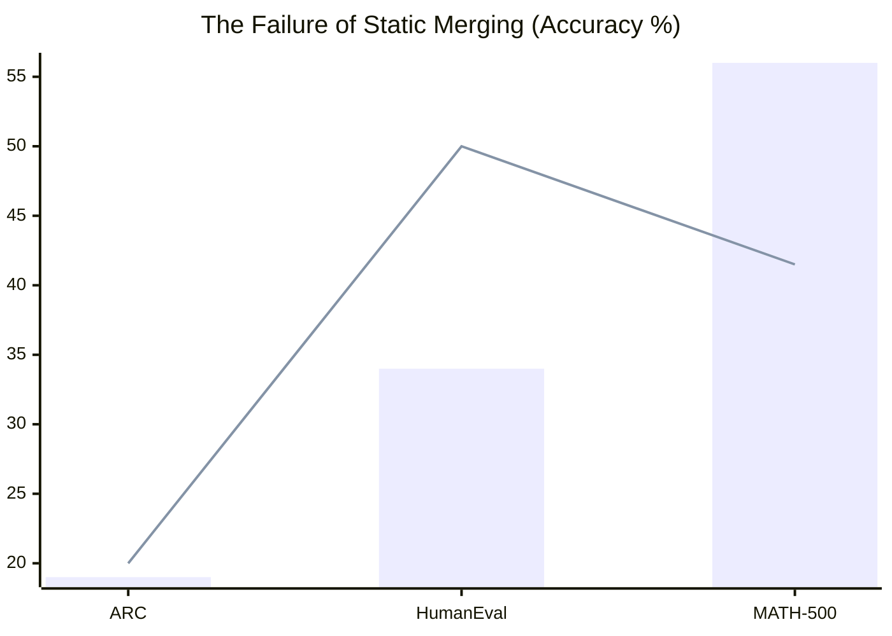

---
language:
- en
license: apache-2.0
base_model: nvidia/NVIDIA-Nemotron-3-Nano-30B-A3B-BF16
tags:
- peft
- lora
- dare
- ties
- model-merging
- nemotron
- mamba
- mathematical-reasoning
- stem
- quantized
- 4bit
- bnb
pipeline_tag: text-generation
model-index:
- name: nemotron-30b-multi-domain-merged-peft
  results:
  - task:
      type: text-generation
    dataset:
      name: MATH-500
      type: lighteval/MATH
    metrics:
    - type: accuracy
      value: 0.56
  - task:
      type: text-generation
    dataset:
      name: HumanEval
      type: openai_humaneval
    metrics:
    - type: pass@1
      value: 0.34
  - task:
      type: text-generation
    dataset:
      name: ARC-Challenge
      type: ai2_arc
    metrics:
    - type: accuracy
      value: 0.19
  - task:
      type: text-generation
    dataset:
      name: MBPP
      type: mbpp
    metrics:
    - type: pass@1
      value: 0.0
---

# Nemotron-30B Multi-Domain Merged PEFT

Welcome to the **Nemotron-30B Multi-Domain Merged PEFT**. This is a composite parameter-efficient fine-tuning (PEFT) module for the `nvidia/NVIDIA-Nemotron-3-Nano-30B-A3B-BF16` architecture, statically merged via DARE/TIES weighting from three distinct domain experts: Math, Code, and Science.

*Created as the baseline comparison model for the Mewtwo dynamic routing research project.*

## Quantitative Merging Details

Rather than being trained directly, this adapter was created by algorithmically merging three fine-tuned expert adapters.

- **Merge Technique:** DARE/TIES Uniform Merging
- **Input Adapters:** 
  1. [Math Adapter](https://huggingface.co/uditjain/nemotron-30b-math-reasoner-peft)
  2. [Code Adapter](https://huggingface.co/uditjain/nemotron-30b-code-hyper-reasoner-peft)
  3. [Science Adapter](https://huggingface.co/uditjain/nemotron-30b-science-expert-peft)
- **Base Resolution:** LoRA Rank ($r$)=64, Alpha=128.0
- **Final Output:** Rank-32 unified PEFT module.

## The Composition Emergence Failure (H-COMP)

This model serves as empirical evidence against the current open-source trend of "merging everything." Our core hypothesis tested whether merging multiple distinct logic engines at the 30B parameter scale would create "emergent" cross-domain intelligence.

**The Finding:** Static weight merging strictly failed to produce emergent capability. 
The mathematical realities of the parameter subspaces meant that mashing three distinct reasoning engines together resulted in destructive interference on non-dominant benchmarks, while merely matching the peak performance of the best single expert on dominant benchmarks (e.g., scoring identically to the Code adapter on MATH-500).


*(Blue Bar = Merged Adapter, Red Line = Raw Base Model)*

Notice that on ARC Science reasoning, the merged adapter (19%) actually performs **worse** than the completely untrained base model (20%), proving static parameter collision aggressively destroys capabilities acquired during single-domain training.

## Benchmark Table

| Benchmark | Base Model | Nemotron-30B Multi-Domain Merged PEFT | Delta |
| :--- | :--- | :--- | :--- |
| **ARC-Challenge** (25-shot) | 20.0% | **19%** | -1% |
| **HumanEval** (0-shot) | 50.0% | **34%** | -16% |
| **MATH-500** (0-shot) | 41.5% | **56%** | 14% |
| **MBPP** (0-shot) | 8.0% | **0%** | -8% |

## How to Use (Working Snippet)

This architecture relies on Hybrid Mamba-Attention. The dynamic caching pipeline must be overridden for generation to succeed.

```python
import torch
import sys
from transformers import AutoModelForCausalLM, AutoTokenizer, BitsAndBytesConfig
from peft import PeftModel

model_id = "nvidia/NVIDIA-Nemotron-3-Nano-30B-A3B-BF16"
adapter_id = "uditjain/nemotron-30b-multi-domain-merged-peft"

# 1. Load Base Model and Tokenizer
tokenizer = AutoTokenizer.from_pretrained(model_id)
bnb_config = BitsAndBytesConfig(load_in_4bit=True, bnb_4bit_compute_dtype=torch.bfloat16)

base_model = AutoModelForCausalLM.from_pretrained(
    model_id, 
    device_map="auto", 
    quantization_config=bnb_config
)

# 2. Attach PEFT Adapter
model = PeftModel.from_pretrained(base_model, adapter_id)
model.eval()

# 3. Dynamic Cache Extraction
try:
    model_module = sys.modules[base_model.__class__.__module__]
    HybridMambaAttentionDynamicCache = getattr(model_module, 'HybridMambaAttentionDynamicCache')
    past_key_values = HybridMambaAttentionDynamicCache(
        base_model.config, batch_size=1, dtype=torch.bfloat16, device=model.device
    )
except Exception as e:
    print(f"Warning: Failed to load custom Mamba cache. Generation may be slower or degrade. Error: {e}")
    past_key_values = None

# Format the Prompt
messages = [{"role": "user", "content": "Write a Python script to compute the mass trajectory of a geostationary satellite."}]
prompt = tokenizer.apply_chat_template(messages, tokenize=False, add_generation_prompt=True)

inputs = tokenizer(prompt, return_tensors="pt").to(model.device)

# Generate Output
with torch.no_grad():
    outputs = model.generate(
        **inputs, 
        max_new_tokens=400,
        past_key_values=past_key_values,
        do_sample=False
    )

response = tokenizer.decode(outputs[0][inputs['input_ids'].shape[1]:], skip_special_tokens=True)
print(response)
```

## Intended Use & Limitations
✅ **Intended Use:** Academic evaluation of static merging capabilities vs dynamic token-level PEFT routing. 
❌ **Out-of-Scope:** Production reasoning tasks. The dynamic routing paradigm is vastly superior to this merged artifact.
⚠️ **Limitations:** Severe parameter destruction observed on ARC. This model is presented for transparency and replication, not state-of-the-art capability.

## Citation & Contact

If you use this artifact for replication or merging theory research, please cite:

```bibtex
@misc{jain2026nemotronmerged,
  author = {Udit Jain},
  title = {Nemotron-30B Multi-Domain Merged PEFT},
  year = {2026},
  publisher = {HuggingFace},
  url = {https://huggingface.co/uditjain/nemotron-30b-multi-domain-merged-peft}
}
```

**Collaboration & Queries:** `hello@uditjain.in`
