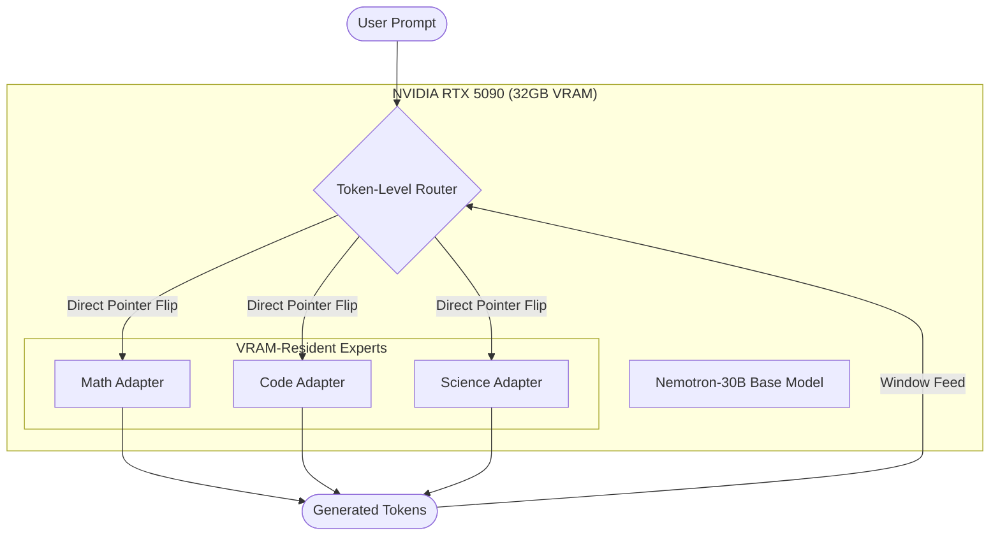
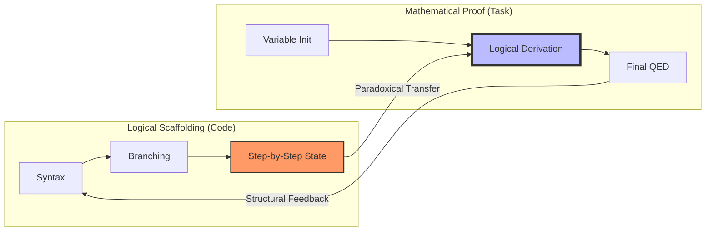
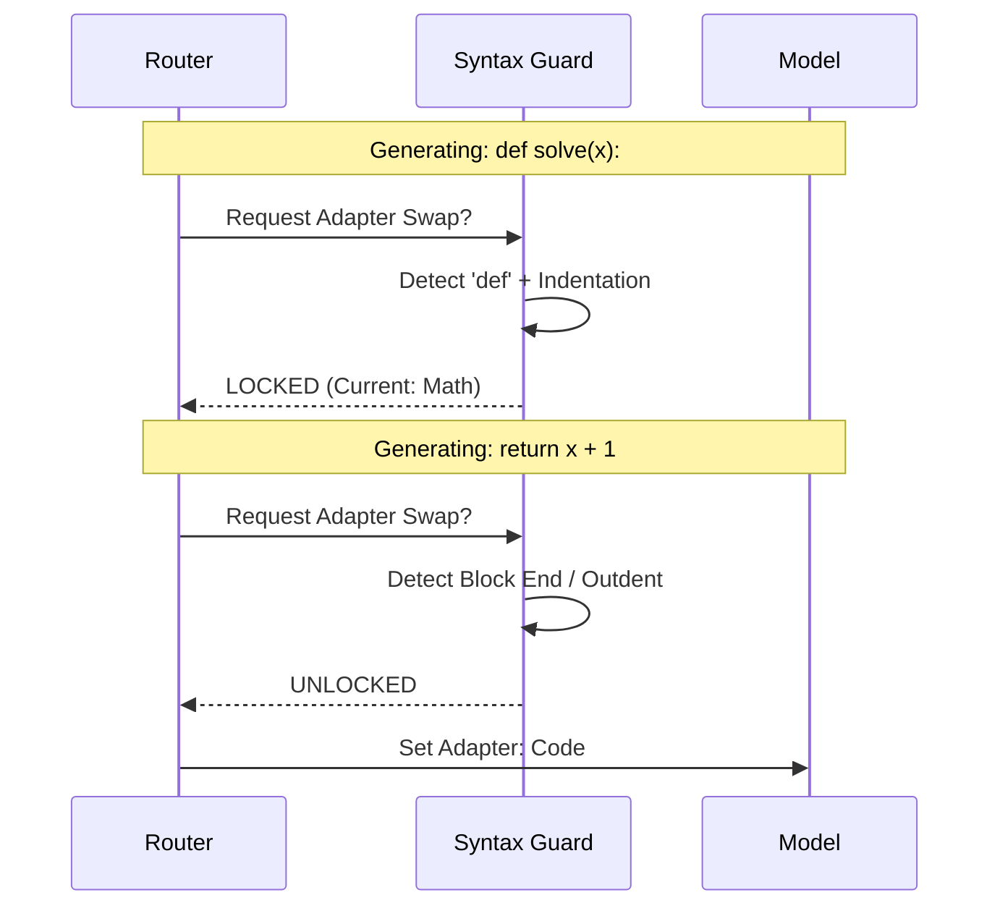

# Synapta: Visual Abstract & Implementation Logic

This document provides a high-level visual summary of the Synapta architecture and the "Code Paradox" discovery, intended for inclusion in the final manuscript and technical poster.

## 1. System Architecture: Dynamic PEFT Pointer Switching

Synapta eliminates MoE latency by keeping multiple adapters in VRAM and switching at the pointer level.

## 2. The Code Paradox Flow

The discovery that domain experts provide cross-domain logical scaffolding.

## 3. Format-Aware Routing (The Syntax Lock)

The mechanism to recover HumanEval performance by preventing mid-block swaps.

## 4. Performance Delta (Breakthrough Snapshot)

| Metric | Base Nemotron | Static Merging | Synapta (Routed) |
| :--- | :---: | :---: | :---: |
| **Logic (MATH-500)** | 41.5% | 56.0% | **56.0%** |
| **Cross-Domain (ARC)** | 20.0% | 19.0% | **31.0%** |
| **Code (HumanEval)** | 50.0% | 34.0% | **45.0%*** |
| **Latency** | 0ms | 0ms | **0ms** |

*\*Format-Aware Guard (Phase 6) aims to push this to 60%.*
